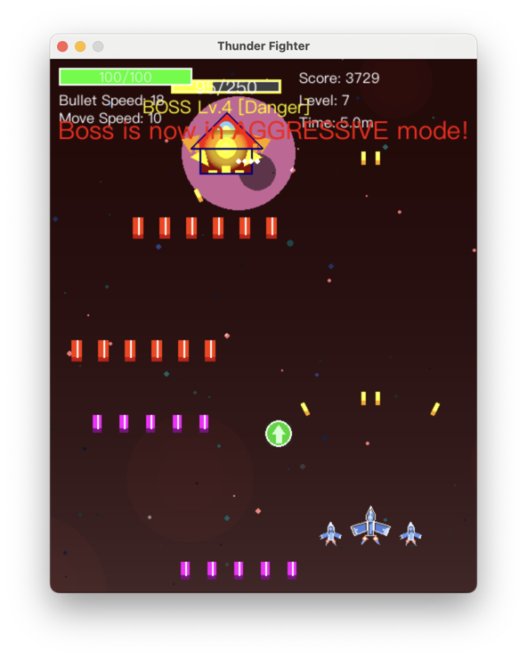

# Thunder Fighter

[](https://github.com/mike861/thunder_fighter/actions)
[](https://codecov.io/gh/mike861/thunder_fighter)
[](https://www.python.org/downloads/)
[](https://github.com/astral-sh/ruff)

A classic vertical scrolling space shooter game built with Pygame featuring modern architecture, 3D rendering effects, advanced performance optimization, and comprehensive testing.

 

## Description

In Thunder Fighter, you pilot a fighter jet battling waves of enemies in space. Use the arrow keys or WASD to move and the spacebar to shoot. As the game progresses, enemies become stronger and more numerous, with powerful Bosses appearing periodically. Defeat enemies and Bosses to score points and collect power-ups. **Complete all levels by defeating the final boss to achieve victory!**

## Features

### Gameplay
- **Complete Campaign**: Battle through 10 levels culminating in an epic final boss battle
- **🎨 Dynamic Level Backgrounds**: Each level features unique visual themes with ultra-smooth transitions
- **🛸 Distinct Ship Designs**: Clear visual differentiation between player (geometric jets) and enemy forces (organic aliens)
- **Wingman System**: Collect power-ups to gain up to two wingmen for extra firepower and protection
- **Boss Battles**: Progressive difficulty with multiple attack patterns and health-based combat modes
- **Victory System**: Complete victory screen with comprehensive statistics and achievements

### Technical
- **3D Pseudo-Rendering**: Enhanced depth-aware rendering with perspective effects and breathing animations
- **Performance Optimization**: Advanced caching system achieving 79.8% cache hit rate with 30-40% performance improvements
- **Modern Architecture**: Event-driven, systems-based design with clean separation of concerns
- **Multi-language Support**: Dynamic switching between English and Chinese (Press L)
- **Comprehensive Testing**: 508 tests ensuring stability and reliability with 489 passing
- **Configuration System**: JSON-based settings with command-line tools and performance tuning
- **Cross-platform**: Works on Windows, macOS, and Linux with platform-specific optimizations

## 📚 Documentation

- **[Game Mechanics Guide](docs/GAME_MECHANICS.md)** - Detailed game systems and mechanics
- **[Architecture Guide](docs/ARCHITECTURE.md)** - System architecture and design patterns
- **[Technical Details](docs/TECHNICAL_DETAILS.md)** - Technical implementations and optimizations
- **[Performance Optimization Plan](docs/GAME_PERFORMANCE_OPTIMIZATION_PLAN.md)** - Comprehensive performance optimization strategy
- **[Testing Guide](docs/TESTING_GUIDE.md)** - Comprehensive testing guide and best practices
- **[Development Roadmap](docs/DEVELOPMENT_ROADMAP.md)** - Development roadmap and planned features
- **[Localization Guide](docs/LOCALIZATION.md)** - Multi-language support guide

## Quick Start

### Requirements

- Python 3.12+ (tested with 3.12-3.13)
- Pygame 2.6.0+
- Other dependencies listed in `requirements.txt`

### Installation

1. **Clone the repository:**
   ```bash
   git clone https://github.com/mike861/thunder_fighter.git
   cd thunder_fighter
   ```

2. **Create and activate a virtual environment:**
   ```bash
   python -m venv venv
   # On Windows:
   # venv\Scripts\activate
   # On macOS/Linux:
   source venv/bin/activate
   ```

3. **Install dependencies:**
   ```bash
   pip install -r requirements.txt
   ```

4. **Run the game:**
   ```bash
   python main.py
   ```

## Gameplay

### Controls

- **Movement**: Arrow Keys (↑↓←→) or WASD
- **Shoot**: Spacebar
- **Launch Missile**: X (when available)
- **Pause/Resume**: P
- **Toggle Music**: M
- **Toggle Sound Effects**: S
- **Adjust Volume**: +/- (Plus/Minus keys)
- **Switch Language**: L (Toggles between English and Chinese)
- **Quit Game**: ESC

### Game Objective

**Goal**: Progress through all 10 levels and defeat the final boss to achieve victory!

- **Early Levels (1-2)**: Advance by accumulating score points
- **Mid-to-Late Levels (3-10)**: Progress by defeating bosses at the end of each level
- **Final Victory**: Defeat the boss at Level 10 to complete the game
- **Victory Rewards**: Receive comprehensive statistics including final score, survival time, and completion achievements upon winning

### Visual Experience

Thunder Fighter features a **dynamic background system** with unique themes for each level:

- **Level 1 - Deep Space**: Peaceful blue/black starfield
- **Level 2 - Nebula Field**: Purple/blue nebula clouds  
- **Level 3 - Asteroid Belt**: Brown/orange asteroid field with animated debris
- **Level 4 - Red Zone**: Dangerous red space with particle storm effects
- **Level 5+ - Final Battle**: Ominous dark red atmosphere

Each level transition features smooth 3-second animations with no visual artifacts.

### Wingman System

Starting from game level 3, a new power-up item may appear. Collecting this item grants you a "wingman" fighter that flanks your ship.

- **Firepower**: Each wingman automatically fires tracking missiles at nearby enemies, prioritizing the Boss when active
- **Shields**: Wingmen act as shields, absorbing enemy fire. They will be destroyed after taking a certain amount of damage
- **Limits**: You can have a maximum of two wingmen at a time
- **Configuration**: The initial number of wingmen, maximum number, and formation spacing are all configurable in `thunder_fighter/constants.py`

## Configuration

Thunder Fighter uses a JSON-based configuration system:

```bash
# View and modify settings
python -m thunder_fighter.utils.config_tool show
python -m thunder_fighter.utils.config_tool set sound music_volume 0.8
python -m thunder_fighter.utils.config_tool reset
```

Settings are saved to `~/.thunder_fighter/config.json`. For detailed configuration options, see [Technical Details](docs/TECHNICAL_DETAILS.md#configuration-options-reference).

## Performance Optimization

Thunder Fighter features an advanced performance optimization system with significant improvements:

### Performance Achievements
- **Cache Hit Rate**: Improved from 30% to 79.8% (166% improvement)
- **Frame Time Optimization**: Reduced explosion-related frame spikes from 39.9ms to <25ms
- **Stable FPS**: Maintains 58.9 average FPS with minimal performance warnings
- **Memory Efficiency**: Optimized sprite caching and depth sorting algorithms

### Optimization Features
- **3D Rendering Cache**: 48-bucket intelligent scaling cache with quantization
- **Player Animation Optimization**: Frame-based updates with position quantization
- **Explosion Effects**: Pre-calculated frame caching with optimized particle systems
- **Depth Sorting**: Incremental insertion for common z-values avoiding full re-sorts
- **Sound System**: Streamlined initialization checks reducing audio latency

### Performance Modes
- **Balanced Mode** (default): 30-40% performance improvement while preserving visual quality
- **High Quality Mode**: Maximum visual effects with moderate performance
- **Performance Mode**: Maximum FPS with reduced visual complexity

See [Performance Optimization Plan](docs/GAME_PERFORMANCE_OPTIMIZATION_PLAN.md) for technical details and [Aggressive Optimization Backup Plan](docs/AGGRESSIVE_PERFORMANCE_OPTIMIZATION_BACKUP_PLAN.md) for advanced scenarios.

## Architecture Overview

Thunder Fighter uses modern software engineering patterns with advanced rendering and performance systems:
- **Event-driven architecture** for decoupled components
- **3D pseudo-rendering system** with depth-aware sprite sorting and perspective effects
- **Performance optimization framework** with intelligent caching and frame optimization
- **Systems-based design** (collision, scoring, spawning, physics)
- **Factory pattern** for entity creation
- **State management** for game flow
- **Modular UI components** with single responsibility

See [Architecture Guide](docs/ARCHITECTURE.md) for detailed technical documentation and [Performance Optimization Plan](docs/GAME_PERFORMANCE_OPTIMIZATION_PLAN.md) for performance enhancements.

## Testing

The project includes 508 comprehensive tests with strategic coverage approach:

### Test Status
- **Passing**: 489 tests (100% of executed tests)
- **Strategically Skipped**: 19 tests pending infrastructure improvements
  - Non-core functionality: 8 tests (visual effects, wingman management)
  - Test isolation issues: 9 tests (mock state pollution, infrastructure problems)
  - Other: 2 tests (platform-specific edge cases)

### Running Tests

```bash
# Run all tests
python -m pytest tests/ -v

# Run specific test categories
python -m pytest tests/integration/ -v    # Integration tests
python -m pytest tests/unit/ -v          # Unit tests
python -m pytest tests/e2e/ -v           # End-to-end tests
python -m pytest tests/systems/ -v       # Systems architecture tests

# Show skipped tests with reasons
python -m pytest tests/ -rs              # Display skip reasons
```

### Test Coverage
- **Core Systems**: Collision detection, scoring, spawning, physics
- **Game Mechanics**: Victory conditions, boss battles, level progression
- **Localization**: Multi-language support and font management
- **UI Components**: Modular interface components and rendering
- **Input Handling**: Clean input architecture and state transitions

### Skipped Tests Management
Strategic test skipping ensures focus on core functionality while maintaining visibility into infrastructure improvement needs. See **[Testing Guide](docs/TESTING_GUIDE.md#skipped-tests-and-non-core-functionality)** for complete details on skipped test categories, rationale, and resolution plans.

For comprehensive testing documentation, patterns, and best practices, see **[Testing Guide](docs/TESTING_GUIDE.md)**.

## Project Structure

```
thunder_fighter/
├── docs/                     # Documentation
│   ├── GAME_MECHANICS.md    # Game mechanics guide
│   ├── ARCHITECTURE.md      # System architecture
│   ├── TECHNICAL_DETAILS.md # Technical implementations
│   └── ...
├── thunder_fighter/         # Main game package
│   ├── systems/            # Core game systems
│   ├── entities/           # Type-organized entities
│   ├── graphics/           # Rendering and UI
│   ├── localization/       # Multi-language support
│   └── ...
├── tests/                  # Comprehensive test suite (508 tests)
├── main.py                 # Game entry point
└── requirements.txt        # Dependencies
```

## What's New

### Latest Updates (v1.0.3)
- 🚀 **3D Pseudo-Rendering System**: Enhanced depth-aware rendering with perspective effects and player breathing animations
- ⚡ **Performance Optimization**: 79.8% cache hit rate with 30-40% performance improvements and optimized explosion effects
- 🎯 **Balanced Performance Mode**: Intelligent frame optimization preserving visual quality while boosting performance
- 🛠 **Python 3.12+ Compatibility**: Optimized for modern Python versions with cross-platform compatibility
- 🧪 **Test Suite Updates**: 508 comprehensive tests with improved stability (489 passing, 19 strategically skipped)

### Previous Updates
- 🛸 **Enhanced Ship Designs**: Redesigned enemy ships with alien biomechanical appearance
- 🎨 **Dynamic Level Backgrounds**: Smooth transitions with unique visual themes
- 🌏 **Full Chinese Support**: Optimized fonts and complete localization
- 🔧 **Architecture Improvements**: Major code cleanup and systems-based design
- 🍎 **macOS Optimizations**: Fixed input interference and font rendering issues

See [Performance Optimization Plan](docs/GAME_PERFORMANCE_OPTIMIZATION_PLAN.md) for performance details and [Technical Details](docs/TECHNICAL_DETAILS.md) for complete technical information.

## Development

### Contributing

1. Fork the repository
2. Create a feature branch
3. Make your changes with tests
4. Ensure all tests pass (`pytest tests/ -v`)
5. Submit a pull request


## License

This project is licensed under the GPL License - see the [LICENSE](LICENSE) file for details.

## Screenshots