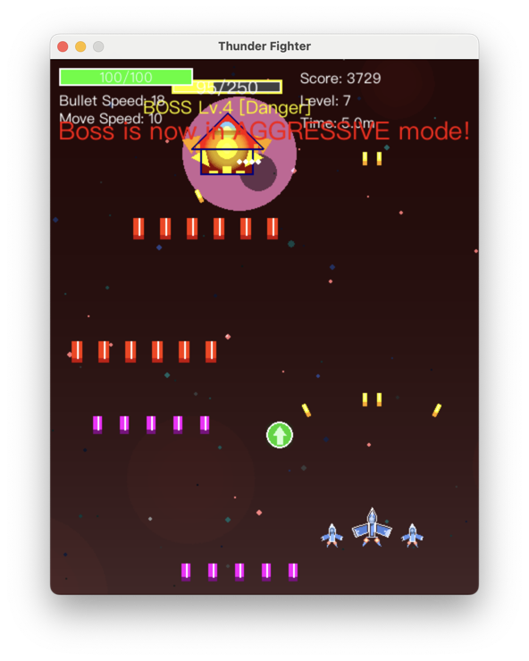

# Thunder Fighter

A classic vertical scrolling space shooter game built with Pygame featuring modern architecture and comprehensive testing.

 

## Description

In Thunder Fighter, you pilot a fighter jet battling waves of enemies in space. Use the arrow keys or WASD to move and the spacebar to shoot. As the game progresses, enemies become stronger and more numerous, with powerful Bosses appearing periodically. Defeat enemies and Bosses to score points and collect power-ups. **Complete all levels by defeating the final boss to achieve victory!**

## Features

### Gameplay
- **Complete Campaign**: Battle through 10 levels culminating in an epic final boss battle
- **🎨 Dynamic Level Backgrounds**: Each level features unique visual themes with ultra-smooth transitions
- **🛸 Distinct Ship Designs**: Clear visual differentiation between player (geometric jets) and enemy forces (organic aliens)
- **Wingman System**: Collect power-ups to gain up to two wingmen for extra firepower and protection
- **Boss Battles**: Progressive difficulty with multiple attack patterns and health-based combat modes
- **Victory System**: Complete victory screen with comprehensive statistics and achievements

### Technical
- **Modern Architecture**: Event-driven, systems-based design with clean separation of concerns
- **Multi-language Support**: Dynamic switching between English and Chinese (Press L)
- **Comprehensive Testing**: 375+ tests ensuring stability and reliability
- **Configuration System**: JSON-based settings with command-line tools
- **Cross-platform**: Works on Windows, macOS, and Linux with platform-specific optimizations

## 📚 Documentation

- **[Game Mechanics Guide](docs/DETAILS.md)** - Detailed game systems and mechanics
- **[Architecture Guide](docs/ARCHITECTURE.md)** - System architecture and design patterns
- **[Technical Details](docs/TECHNICAL_DETAILS.md)** - Technical implementations and optimizations
- **[Development Roadmap](docs/DEVELOPMENT_ROADMAP.md)** - Development roadmap and planned features
- **[Localization Guide](docs/LOCALIZATION.md)** - Multi-language support guide

## Quick Start

### Requirements

- Python 3.7+
- Pygame 2.0.0+
- Other dependencies listed in `requirements.txt`

### Installation

1. **Clone the repository:**
   ```bash
   git clone https://github.com/mike861/thunder_fighter.git
   cd thunder_fighter
   ```

2. **Create and activate a virtual environment:**
   ```bash
   python -m venv venv
   # On Windows:
   # venv\Scripts\activate
   # On macOS/Linux:
   source venv/bin/activate
   ```

3. **Install dependencies:**
   ```bash
   pip install -r requirements.txt
   ```

4. **Run the game:**
   ```bash
   python main.py
   ```

## Gameplay

### Controls

- **Movement**: Arrow Keys (↑↓←→) or WASD
- **Shoot**: Spacebar
- **Launch Missile**: X (when available)
- **Pause/Resume**: P
- **Toggle Music**: M
- **Toggle Sound Effects**: S
- **Adjust Volume**: +/- (Plus/Minus keys)
- **Switch Language**: L (Toggles between English and Chinese)
- **Quit Game**: ESC

### Game Objective

**Goal**: Progress through all 10 levels and defeat the final boss to achieve victory!

- **Early Levels (1-2)**: Advance by accumulating score points
- **Mid-to-Late Levels (3-10)**: Progress by defeating bosses at the end of each level
- **Final Victory**: Defeat the boss at Level 10 to complete the game
- **Victory Rewards**: Receive comprehensive statistics including final score, survival time, and completion achievements upon winning

### Visual Experience

Thunder Fighter features a **dynamic background system** with unique themes for each level:

- **Level 1 - Deep Space**: Peaceful blue/black starfield
- **Level 2 - Nebula Field**: Purple/blue nebula clouds  
- **Level 3 - Asteroid Belt**: Brown/orange asteroid field with animated debris
- **Level 4 - Red Zone**: Dangerous red space with particle storm effects
- **Level 5+ - Final Battle**: Ominous dark red atmosphere

Each level transition features smooth 3-second animations with no visual artifacts.

### Wingman System

Starting from game level 3, a new power-up item may appear. Collecting this item grants you a "wingman" fighter that flanks your ship.

- **Firepower**: Each wingman automatically fires tracking missiles at nearby enemies, prioritizing the Boss when active
- **Shields**: Wingmen act as shields, absorbing enemy fire. They will be destroyed after taking a certain amount of damage
- **Limits**: You can have a maximum of two wingmen at a time
- **Configuration**: The initial number of wingmen, maximum number, and formation spacing are all configurable in `thunder_fighter/constants.py`

## Configuration Management

Thunder Fighter includes a comprehensive configuration system that allows you to customize various aspects of the game.

### Configuration Tool

Use the built-in configuration tool to manage settings:

```bash
# Show current configuration
python -m thunder_fighter.utils.config_tool show

# Set music volume to 80%
python -m thunder_fighter.utils.config_tool set sound music_volume 0.8

# Enable developer mode
python -m thunder_fighter.utils.config_tool set debug dev_mode true

# Set difficulty to hard
python -m thunder_fighter.utils.config_tool set gameplay difficulty hard

# Reset all settings to defaults
python -m thunder_fighter.utils.config_tool reset
```

### Available Settings

| Section | Setting | Description | Default |
|---------|---------|-------------|---------|
| **Sound** | `music_volume` | Background music volume (0.0-1.0) | 0.5 |
| | `sound_volume` | Sound effects volume (0.0-1.0) | 0.7 |
| | `music_enabled` | Enable/disable music | true |
| | `sound_enabled` | Enable/disable sound effects | true |
| **Display** | `fullscreen` | Enable fullscreen mode | false |
| | `screen_scaling` | Screen scaling factor | 1.0 |
| **Gameplay** | `difficulty` | Game difficulty (easy/normal/hard) | normal |
| | `initial_lives` | Starting number of lives | 3 |
| **Debug** | `dev_mode` | Enable developer mode | false |
| | `log_level` | Logging level | INFO |

### Configuration File

Settings are automatically saved to `~/.thunder_fighter/config.json`. You can also edit this file directly if preferred.

### Advanced Configuration

```bash
# Adjust Log Level (Optional)
# Set the THUNDER_FIGHTER_LOG_LEVEL environment variable
# Windows
set THUNDER_FIGHTER_LOG_LEVEL=DEBUG
python main.py

# Linux/macOS
THUNDER_FIGHTER_LOG_LEVEL=DEBUG python main.py
```

## Architecture Overview

Thunder Fighter uses modern software engineering patterns:
- **Event-driven architecture** for decoupled components
- **Systems-based design** (collision, scoring, spawning, physics)
- **Factory pattern** for entity creation
- **State management** for game flow
- **Modular UI components** with single responsibility

See [Architecture Guide](docs/ARCHITECTURE.md) for detailed technical documentation.

## Testing

The project includes 375+ comprehensive tests covering all aspects of the game:

### Running Tests

```bash
# Run all tests
python -m pytest tests/ -v

# Run specific test categories
python -m pytest tests/integration/ -v    # Integration tests
python -m pytest tests/unit/ -v          # Unit tests
python -m pytest tests/e2e/ -v           # End-to-end tests
python -m pytest tests/systems/ -v       # Systems architecture tests
```

### Test Coverage
- **Core Systems**: Collision detection, scoring, spawning, physics
- **Game Mechanics**: Victory conditions, boss battles, level progression
- **Localization**: Multi-language support and font management
- **UI Components**: Modular interface components and rendering
- **Input Handling**: Clean input architecture and state transitions

## Project Structure

```
thunder_fighter/
├── docs/                     # Documentation
│   ├── DETAILS.md           # Game mechanics guide
│   ├── ARCHITECTURE.md      # System architecture
│   ├── TECHNICAL_DETAILS.md # Technical implementations
│   └── ...
├── thunder_fighter/         # Main game package
│   ├── systems/            # Core game systems
│   ├── entities/           # Type-organized entities
│   ├── graphics/           # Rendering and UI
│   ├── localization/       # Multi-language support
│   └── ...
├── tests/                  # Comprehensive test suite (375+ tests)
├── main.py                 # Game entry point
└── requirements.txt        # Dependencies
```

## What's New

- 🛸 **Enhanced Ship Designs**: Redesigned enemy ships with alien biomechanical appearance
- 🎨 **Dynamic Level Backgrounds**: Smooth transitions with unique visual themes
- 🌏 **Full Chinese Support**: Optimized fonts and complete localization
- 🔧 **Architecture Improvements**: Major code cleanup and systems-based design
- 📊 **Enhanced Testing**: 375+ comprehensive tests with specialized coverage
- 🍎 **macOS Optimizations**: Fixed input interference and font rendering issues

See [Technical Details](docs/TECHNICAL_DETAILS.md) for complete technical information and [Development History](docs/DEVELOPMENT_HISTORY.md) for detailed changelog.

## Development

### Configuration

```bash
# View current settings
python -m thunder_fighter.utils.config_tool show

# Modify settings
python -m thunder_fighter.utils.config_tool set sound music_volume 0.8
python -m thunder_fighter.utils.config_tool set debug dev_mode true

# Reset to defaults
python -m thunder_fighter.utils.config_tool reset
```

### Contributing

1. Fork the repository
2. Create a feature branch
3. Make your changes with tests
4. Ensure all tests pass (`pytest tests/ -v`)
5. Submit a pull request


## License

This project is licensed under the MIT License - see the [LICENSE](LICENSE) file for details.

## Screenshots