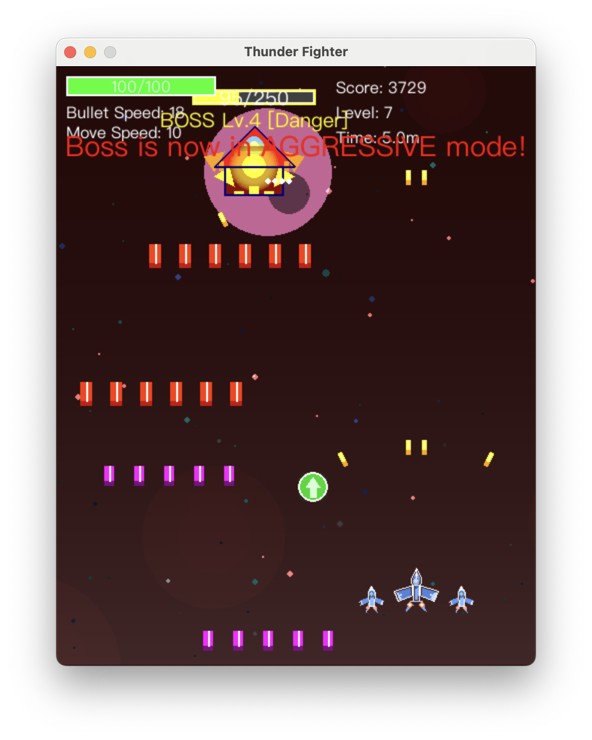

# 雷霆战机

一款经典的纵向滚动太空射击游戏，使用 Pygame 构建，具有现代化的架构和全面的测试。



## 描述

在《雷霆战机》中，你将驾驶一架战斗机，在太空中与一波波敌人作战。使用方向键或 WASD 移动，使用空格键射击。随着游戏的进行，敌人会变得更强大、数量更多，强大的 Boss 会定期出现。击败敌人和 Boss 可以获得积分并收集强化道具。**通过击败最终 Boss 完成所有关卡，取得胜利！**

## 特色

### 游戏玩法
- **完整的战役**: 闯过 10 个关卡，最终迎来史诗级的最终 Boss 战
- **🎨 动态关卡背景**: 每个关卡都有独特的视觉主题和超平滑的过渡效果
- **🛸 独特的飞船设计**: 玩家（几何喷气机）和敌方（有机外星人）之间有清晰的视觉区分
- **僚机系统**: 收集强化道具，最多可获得两架僚机，提供额外的火力和保护
- **Boss 战**: 难度递增，具有多种攻击模式和基于生命值的战斗模式
- **胜利系统**: 完整的胜利画面，包含全面的统计数据和成就

### 技术
- **现代架构**: 事件驱动、基于系统的设计，关注点分离清晰
- **多语言支持**: 动态切换中英文（按 L 键）
- **全面测试**: 375+ 项测试确保稳定性和可靠性
- **配置系统**: 基于 JSON 的设置，带命令行工具
- **跨平台**: 可在 Windows、macOS 和 Linux 上运行，并针对特定平台进行了优化

## 📚 文档

- **[游戏机制指南](docs/GAME_MECHANICS_ZH.md)** - 详细的游戏系统和机制
- **[架构指南](docs/ARCHITECTURE_ZH.md)** - 系统架构和设计模式
- **[技术细节](docs/TECHNICAL_DETAILS_ZH.md)** - 技术实现和优化
- **[开发路线图](docs/DEVELOPMENT_ROADMAP.md)** - 开发路线图和计划功能
- **[本地化指南](docs/LOCALIZATION.md)** - 多语言支持指南

## 快速开始

### 系统要求

- Python 3.8+
- Pygame 2.0.0+
- `requirements.txt` 中列出的其他依赖项

### 安装

1. **克隆仓库：**
   ```bash
   git clone https://github.com/mike861/thunder_fighter.git
   cd thunder_fighter
   ```

2. **创建并激活虚拟环境：**
   ```bash
   python -m venv venv
   # Windows 系统：
   # venv\Scripts\activate
   # macOS/Linux 系统：
   source venv/bin/activate
   ```

3. **安装依赖：**
   ```bash
   pip install -r requirements.txt
   ```

4. **运行游戏：**
   ```bash
   python main.py
   ```

## 游戏玩法

### 控制

- **移动**: 方向键 (↑↓←→) 或 WASD
- **射击**: 空格键
- **发射导弹**: X (可用时)
- **暂停/继续**: P
- **切换音乐**: M
- **切换音效**: S
- **调节音量**: +/- (加/减号键)
- **切换语言**: L (中英文切换)
- **退出游戏**: ESC

### 游戏目标

**目标**: 闯过所有 10 个关卡并击败最终 Boss，取得胜利！

- **早期关卡 (1-2)**: 通过累积得分晋级
- **中后期关卡 (3-10)**: 通过击败每关的 Boss 晋级
- **最终胜利**: 击败第 10 关的 Boss 完成游戏
- **胜利奖励**: 获胜后获得全面的统计数据，包括最终得分、生存时间和完成成就

### 视觉体验

《雷霆战机》拥有动态背景系统，每个关卡都有独特的主题：

- **第 1 关 - 深空**: 宁静的蓝/黑色星空
- **第 2 关 - 星云区**: 紫/蓝色星云
- **第 3 关 - 小行星带**: 棕/橙色小行星带，带有动态碎片
- **第 4 关 - 红色区域**: 危险的红色太空，伴有粒子风暴效果
- **第 5+ 关 - 最终之战**: 充满不祥预兆的暗红色氛围

每个关卡过渡都有平滑的 3 秒动画，无视觉瑕疵。

### 僚机系统

从第 3 游戏关卡开始，可能会出现新的强化道具。收集此道具可获得一架“僚机”战机，它会伴随在你的飞船两侧。

- **火力**: 每架僚机会自动向附近的敌人发射跟踪导弹，当 Boss 出现时会优先攻击 Boss
- **护盾**: 僚机可作为护盾，吸收敌方火力。在承受一定量伤害后会被摧毁
- **数量限制**: 最多可以同时拥有两架僚机
- **配置**: 僚机的初始数量、最大数量和编队间距均可在 `thunder_fighter/constants.py` 中配置

## 配置

《雷霆战机》使用基于 JSON 的配置系统：

```bash
# 查看和修改设置
python -m thunder_fighter.utils.config_tool show
python -m thunder_fighter.utils.config_tool set sound music_volume 0.8
python -m thunder_fighter.utils.config_tool reset
```

设置保存在 `~/.thunder_fighter/config.json`。有关详细的配置选项，请参阅[技术细节](docs/TECHNICAL_DETAILS_ZH.md#configuration-options-reference)。

## 架构概览

《雷霆战机》采用了现代软件工程模式：
- **事件驱动架构**，实现组件解耦
- **基于系统的设计**（碰撞、计分、生成、物理）
- **工厂模式**，用于实体创建
- **状态管理**，用于游戏流程控制
- **模块化 UI 组件**，遵循单一职责原则

有关详细的技术文档和[代码组织](docs/ARCHITECTURE.md#code-organization)，请参阅[架构指南](docs/ARCHITECTURE_ZH.md)。

## 测试

该项目包含 375+ 项全面测试，覆盖了游戏的各个方面：

### 运行测试

```bash
# 运行所有测试
python -m pytest tests/ -v

# 运行特定类别的测试
python -m pytest tests/integration/ -v    # 集成测试
python -m pytest tests/unit/ -v          # 单元测试
python -m pytest tests/e2e/ -v           # 端到端测试
python -m pytest tests/systems/ -v       # 系统架构测试
```

### 测试覆盖范围
- **核心系统**: 碰撞检测、计分、生成、物理
- **游戏机制**: 胜利条件、Boss 战、关卡进程
- **本地化**: 多语言支持和字体管理
- **UI 组件**: 模块化界面组件和渲染
- **输入处理**: 清晰的输入架构和状态转换

## 项目结构

```
thunder_fighter/
├── docs/                     # 文档
│   ├── GAME_MECHANICS.md    # 游戏机制指南
│   ├── ARCHITECTURE.md      # 系统架构
│   ├── TECHNICAL_DETAILS.md # 技术实现
│   └── ...
├── thunder_fighter/         # 主游戏包
│   ├── systems/            # 核心游戏系统
│   ├── entities/           # 按类型组织的实体
│   ├── graphics/           # 渲染和 UI
│   ├── localization/       # 多语言支持
│   └── ...
├── tests/                  # 全面的测试套件 (375+ 测试)
├── main.py                 # 游戏入口点
└── requirements.txt        # 依赖项
```

## 最新更新

- 🛸 **强化飞船设计**: 重新设计了具有外星生物力学外观的敌方飞船
- 🎨 **动态关卡背景**: 具有独特视觉主题的平滑过渡
- 🌏 **全中文支持**: 优化了字体并完成了本地化
- 🔧 **架构改进**: 主要代码清理和基于系统的设计
- 📊 **增强测试**: 375+ 项具有专门覆盖范围的综合测试
- 🍎 **macOS 优化**: 修复了输入干扰和字体渲染问题

有关完整的技术信息，请参阅[技术细节](docs/TECHNICAL_DETAILS.md)，有关详细的更新日志，请参阅[开发历史](docs/DEVELOPMENT_HISTORY.md)。

## 开发

### 贡献

1. Fork 本仓库
2. 创建特性分支
3. 进行更改并添加测试
4. 确保所有测试通过 (`pytest tests/ -v`)
5. 提交拉取请求


## 许可证

本项目根据 GPL 许可证授权 - 详情请参阅 [LICENSE](LICENSE) 文件。

## 游戏截图