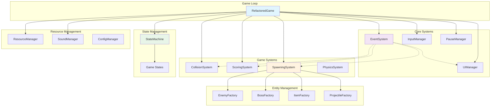
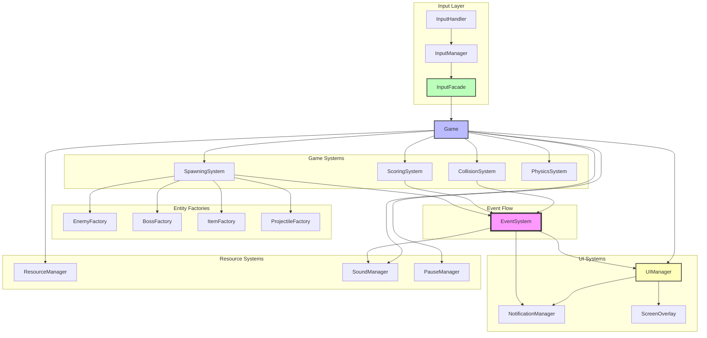
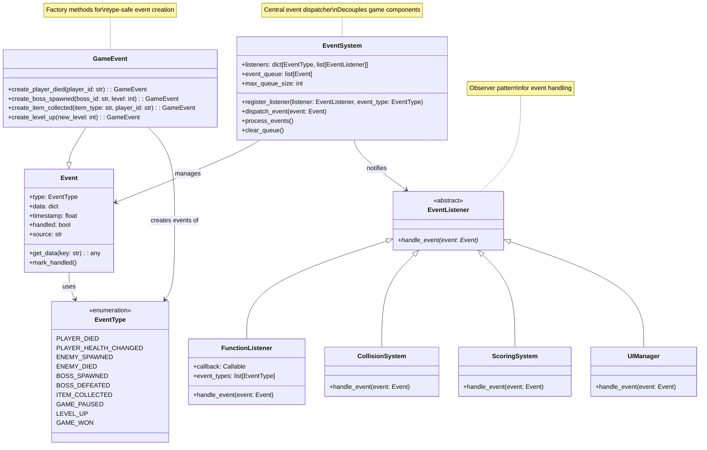
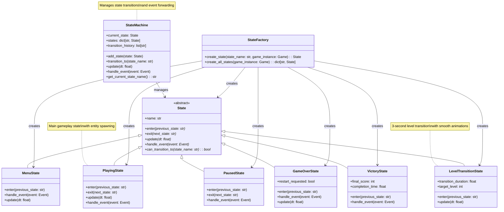
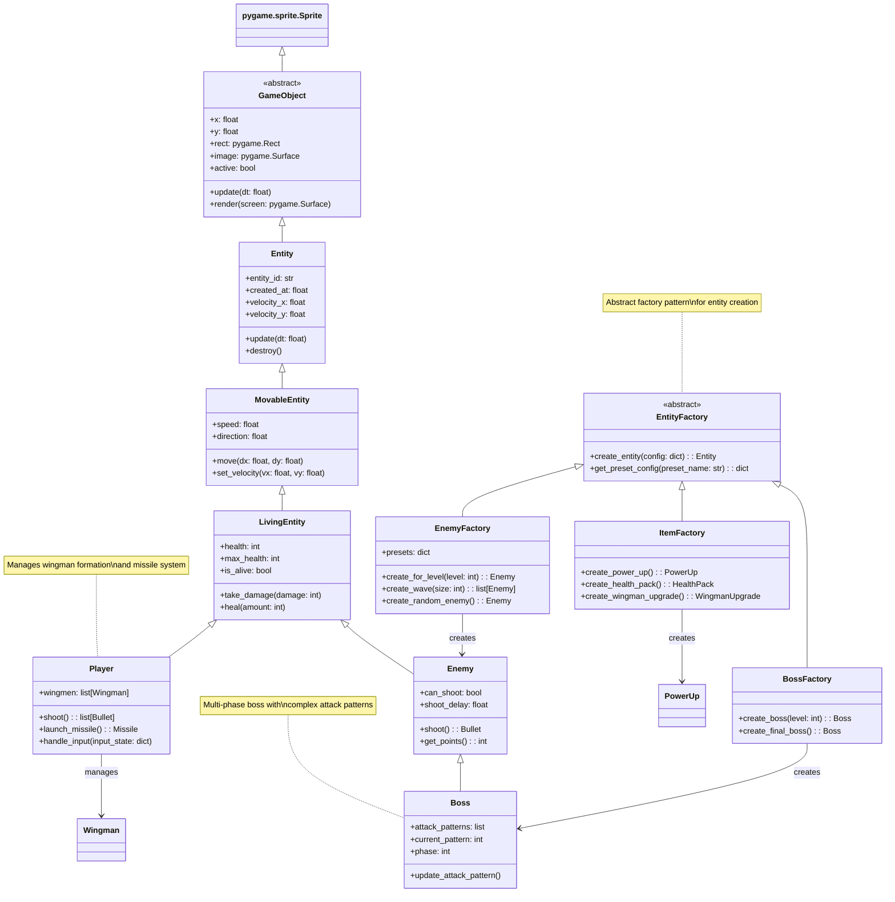

# Thunder Fighter Architecture Guide

## Overview

Thunder Fighter uses a modern, modular architecture designed for maintainability, testability, and extensibility. The system is built around event-driven communication, systems-based design, and clear separation of concerns.

## Architecture Diagrams

### Core Architecture Overview

This diagram shows the high-level relationships between major system components:



### System Interactions

This diagram illustrates how different systems communicate and interact:



## Core Design Principles

### Event-Driven Architecture
Game components communicate through `EventSystem` rather than direct coupling. All game events are defined in `events/game_events.py`.

#### Event System Class Diagram



### Systems-Based Architecture
Core game logic is organized into dedicated systems in `systems/`:
- `CollisionSystem` - Unified collision detection and resolution for all entity interactions
- `ScoringSystem` - Centralized score management with level progression and achievement tracking
- `SpawningSystem` - Entity spawning coordination integrating all factory classes
- `PhysicsSystem` - Movement, boundaries, and collision detection for game physics

### Factory Pattern
Type-organized entity creation in `entities/`:
- `entities/enemies/` - `EnemyFactory` and `BossFactory` with difficulty scaling
- `entities/projectiles/` - `ProjectileFactory` for bullets and missiles
- `entities/items/` - `ItemFactory` for power-ups and collectibles
- `entities/player/` - Player and wingman entity management

### Single Responsibility
Each system has clear boundaries and focused responsibilities.

## System Architecture

### Input System Architecture

**Unified Input System**: Clean input architecture in `systems/input/`:
- `InputHandler` - Raw event processing with macOS screenshot interference handling
- `InputManager` - Event coordination and state management
- `InputFacade` - High-level input interface for game logic

The layered architecture provides:
- **Raw Event Processing**: Platform-specific event handling with fallback mechanisms
- **State Management**: Input state coordination and validation
- **Game Interface**: High-level input interface for game logic

### State Management System

**State Pattern**: Game states managed through `StateMachine` in `state/`:

#### Core Components
1. **GameState** - Data structure holding all game state information
2. **GameStateManager** - Centralized manager for state data and transitions
3. **StateMachine** - Generic state machine framework
4. **State** - Abstract base class for individual game states
5. **Concrete States** - Specific implementations for each game mode
6. **StateFactory** - Factory for creating state instances

#### State Types
- **MenuState** - Main menu (ready for future implementation)
- **PlayingState** - Active gameplay with enemy/boss/item spawning
- **PausedState** - Game paused with adjusted music volume
- **GameOverState** - Game over screen with restart/exit handling
- **VictoryState** - Victory screen with completion statistics
- **LevelTransitionState** - Level transition animations with 3-second timer

#### Key Features
- **Centralized State Management**: All game state in one place
- **Type-Safe State Transitions**: Clear, validated transitions
- **Event-Driven Architecture**: State change listeners and callbacks
- **Separation of Concerns**: Each state handles its own logic

#### State Management Class Diagram



### Background System Architecture

**Double-Buffered Dynamic Backgrounds**: Revolutionary visual enhancement system

#### Technical Implementation
- **Double Buffering Technology**: Pre-rendering with alpha blending
- **Ultra-Smooth Transitions**: Cubic bezier curve easing with 3-second duration
- **Level-Based Themes**: Unique visual themes reflecting difficulty progression
- **Enhanced Special Effects**: Space storms and asteroid fields with alpha support

#### Visual Themes
- **Level 1 - Deep Space**: Blue/black color scheme, peaceful atmosphere
- **Level 2 - Nebula Field**: Purple/blue colors with increased nebula density
- **Level 3 - Asteroid Belt**: Brown/orange tones with animated asteroid field
- **Level 4 - Red Zone**: Red/orange colors with space storm particles
- **Level 5 - Final Battle**: Dark red/black with intense storm effects

#### Performance Optimizations
- **Buffer Reuse**: Surfaces only recreated on screen size change
- **Hardware Acceleration**: Uses `pygame.BLEND_ALPHA_SDL2`
- **Efficient Alpha Handling**: Minimal state changes

## Component Systems

### UI System Architecture

**Modular Component-Based UI** in `graphics/ui/`:
- `HealthBarComponent` - Dynamic health displays with color-coded states
- `NotificationManager` - Game notifications and achievements system
- `GameInfoDisplay` - Score, level, and elapsed time display
- `PlayerStatsDisplay` - Player statistics and upgrades information (with reset method)
- `BossStatusDisplay` - Boss health and combat modes (with reset method)
- `ScreenOverlayManager` - Pause, victory, and game over screens
- `DevInfoDisplay` - Developer debug information (FPS, positions, etc.)

### Configuration System

**JSON-Based Configuration**: Stored at `~/.thunder_fighter/config.json`
- Runtime configuration updates through `config_tool.py`
- All gameplay parameters configurable through `constants.py`
- Environment variable support (`THUNDER_FIGHTER_LOG_LEVEL`)

### Resource Management

**Centralized Asset Loading**: `ResourceManager` provides:
- Asset caching and optimization
- Font management with platform-specific optimizations
- Sound and music management with health monitoring
- Image loading with format support (PNG, JPG, etc.)

### Pause Management

**Dedicated PauseManager Component**: Extracted pause logic in `utils/pause_manager.py`
- Pause-aware timing calculations and cooldown mechanisms
- Comprehensive statistics tracking
- Dependency injection support for enhanced testability

## Entity Architecture

### Base Entity System

**Hierarchical Entity Structure** in `entities/base.py`:
- `GameObject` - Base class for all game objects
- `Entity` - Enhanced game entity with lifecycle management
- `EntityFactory` - Base factory class for entity creation

### Type-Organized Entity System

**Factory Pattern Implementation**:
- **enemies/** - Enemy entities and factories with difficulty scaling
- **projectiles/** - Bullets and missiles with tracking capabilities
- **items/** - Power-ups and collectibles with configurable effects
- **player/** - Player and wingman entities with formation management

#### Entity System Class Diagram



## Graphics and Effects

### Visual Effects System

**Modular Effects Architecture** in `graphics/effects/`:
- `notifications.py` - Complete notification system with position attributes
- `explosions.py` - Explosion and hit effect functions
- `flash_effects.py` - Flash effect management system

### Rendering System

**Optimized Rendering Pipeline**:
- Sprite groups for batch operations
- Object pooling for frequently created entities
- Performance profiling for critical sections

## Testing Architecture

### Comprehensive Test Coverage

**375 Tests** organized by category:
- **Unit Tests (90+)**: Entity factories, components, pause system, localization
- **Integration Tests (9)**: Event system flow, component interactions
- **End-to-End Tests (9)**: Complete game flow scenarios
- **Systems Tests**: Core systems architecture validation
- **Events Tests**: Event-driven architecture testing
- **Localization Tests**: Multi-language support testing

### Testing Principles
- **Interface-Focused Testing**: Tests focus on behavior and public interfaces
- **Dependency Injection**: Enhanced interfaces for easier testing
- **Mock External Dependencies**: Pygame surfaces, sounds mocked appropriately
- **Comprehensive Coverage**: 90%+ coverage for critical systems

## Performance Considerations

### Optimization Strategies
- **Sprite Groups**: Batch operations for entity management
- **Object Pooling**: Reuse frequently created entities
- **Resource Caching**: Asset loading optimization
- **Event-Driven Updates**: Only processes relevant changes

### Memory Management
- **Lazy Initialization**: Resources loaded when needed
- **Buffer Reuse**: Efficient surface management
- **Cleanup Protocols**: Proper resource disposal

## Future Architecture Enhancements

### Planned Improvements
1. **State Persistence**: Save/load game states
2. **Nested States**: Sub-states within main states
3. **Dynamic Lighting**: Background interaction with gameplay events
4. **Enhanced Particle Systems**: Advanced environmental effects
5. **Component Entity System**: Full ECS architecture migration

### Extension Points
- Custom state validation rules
- State-specific configuration
- Dynamic entity creation
- Analytics and monitoring integration

## Code Organization

### Directory Structure

Thunder Fighter follows a modular directory structure with clear separation of concerns:

```
thunder_fighter/
├── assets/                   # Game assets (fonts, images, sounds, music)
│   ├── fonts/               # Font files for localization
│   ├── images/              # Sprite images and graphics
│   ├── music/               # Background music files
│   └── sounds/              # Sound effect files
├── entities/                # Type-organized game entities
│   ├── base.py             # Base entity classes and factory
│   ├── enemies/            # Enemy entities and factories
│   │   ├── boss.py         # Boss entity implementation
│   │   ├── boss_factory.py # Boss creation with difficulty scaling
│   │   ├── enemy.py        # Enemy entity implementation
│   │   └── enemy_factory.py # Enemy creation and level progression
│   ├── items/              # Power-up items and collectibles
│   │   ├── item_factory.py # Item creation and spawn logic
│   │   └── items.py        # Item entity implementations
│   ├── player/             # Player-related entities
│   │   ├── player.py       # Player entity and controls
│   │   └── wingman.py      # Wingman companion entities
│   └── projectiles/        # Bullets and missiles
│       ├── bullets.py      # Bullet entity implementations
│       ├── missile.py      # Missile entity with tracking
│       └── projectile_factory.py # Projectile creation system
├── events/                 # Event-driven architecture
│   ├── event_system.py    # Core event system implementation
│   └── game_events.py     # Game-specific event definitions
├── graphics/               # Rendering and visual effects
│   ├── background.py       # Dynamic background system
│   ├── renderers.py        # Core rendering functions
│   ├── effects/            # Visual effects system
│   │   ├── explosion.py    # Explosion effect implementations
│   │   ├── explosions.py   # Explosion management functions
│   │   ├── flash_effects.py # Flash effect system
│   │   ├── notifications.py # Notification system
│   │   ├── particles.py    # Particle effect system
│   │   └── stars.py        # Star field background elements
│   └── ui/                 # User interface components
│       ├── manager.py      # UI management and coordination
│       └── components/     # Modular UI components
│           ├── boss_status_display.py # Boss health and status
│           ├── dev_info_display.py    # Developer debug info
│           ├── game_info_display.py   # Score and level display
│           ├── health_bar.py          # Player health bar
│           ├── notification_manager.py # Notification system
│           ├── player_stats_display.py # Player statistics
│           └── screen_overlay_manager.py # Game state overlays
├── localization/           # Multi-language support
│   ├── en.json            # English translations
│   ├── zh.json            # Chinese translations
│   ├── font_support.py    # Font management system
│   └── loader.py          # Language loading abstractions
├── sprites/                # Legacy sprite classes (maintained for compatibility)
│   ├── boss.py            # Legacy boss sprite
│   ├── bullets.py         # Legacy bullet sprites
│   ├── enemy.py           # Legacy enemy sprite
│   ├── explosion.py       # Legacy explosion sprite
│   ├── items.py           # Legacy item sprites
│   ├── missile.py         # Legacy missile sprite
│   ├── player.py          # Legacy player sprite
│   └── wingman.py         # Legacy wingman sprite
├── state/                  # Game state management
│   ├── game_state.py      # Game state data structures
│   ├── game_states.py     # Concrete state implementations
│   └── state_machine.py   # Generic state machine framework
├── systems/                # Core game systems
│   ├── collision.py       # Unified collision detection
│   ├── physics.py         # Movement and physics
│   ├── scoring.py         # Score management system
│   ├── spawning.py        # Entity spawning coordination
│   └── input/             # Unified input management
│       ├── facade.py      # High-level input interface
│       ├── handler.py     # Raw event processing
│       ├── manager.py     # Event coordination
│       ├── adapters/      # Platform-specific adapters
│       │   ├── pygame_adapter.py # Pygame input adapter
│       │   └── test_adapter.py   # Testing input adapter
│       └── core/          # Core input processing
│           ├── boundaries.py # Input boundary validation
│           ├── commands.py   # Input command system
│           ├── events.py     # Input event definitions
│           └── processor.py  # Input processing logic
├── utils/                  # Utility modules
│   ├── collisions.py      # Collision utility functions
│   ├── config_manager.py  # Configuration management
│   ├── config_tool.py     # Command-line configuration tool
│   ├── logger.py          # Logging system
│   ├── pause_manager.py   # Pause management system
│   ├── resource_manager.py # Asset loading and caching
│   ├── score.py           # Score tracking utilities
│   └── sound_manager.py   # Audio management system
├── config.py              # Game configuration settings
├── constants.py           # Game constants and parameters
└── game.py               # Main game class and game loop
```

### Core Modules

#### Game Loop and Main Logic
- **`game.py`** - Main game class containing the game loop, entity management, and core gameplay logic
- **`config.py`** - Configuration loading and management
- **`constants.py`** - All game constants, parameters, and configurable values

#### Entity System
- **`entities/base.py`** - Base classes for all game entities and factory pattern
- **`entities/enemies/`** - Enemy entities with progressive difficulty and boss battles
- **`entities/player/`** - Player character and wingman companion system
- **`entities/projectiles/`** - Bullet and missile systems with tracking capabilities
- **`entities/items/`** - Power-up items and collectible system

#### Core Systems
- **`systems/collision.py`** - Unified collision detection for all entity interactions
- **`systems/scoring.py`** - Centralized score management and level progression
- **`systems/spawning.py`** - Entity spawning coordination across all factories
- **`systems/physics.py`** - Movement, boundaries, and physics calculations
- **`systems/input/`** - Complete input management with platform-specific handling

#### Graphics and UI
- **`graphics/background.py`** - Dynamic background system with level-specific themes
- **`graphics/renderers.py`** - Core rendering functions and sprite management
- **`graphics/effects/`** - Visual effects including explosions, particles, and notifications
- **`graphics/ui/`** - Modular UI components with single responsibility design

#### State Management
- **`state/state_machine.py`** - Generic state machine framework
- **`state/game_states.py`** - Concrete game state implementations (playing, paused, victory, etc.)
- **`state/game_state.py`** - Game state data structures and management

#### Event System
- **`events/event_system.py`** - Core event-driven architecture implementation
- **`events/game_events.py`** - Game-specific event definitions and types

#### Utility Systems
- **`utils/resource_manager.py`** - Centralized asset loading with caching
- **`utils/sound_manager.py`** - Audio system with health monitoring and auto-recovery
- **`utils/pause_manager.py`** - Pause-aware timing and state management
- **`utils/config_tool.py`** - Command-line configuration management tool
- **`utils/logger.py`** - Standardized logging system

#### Localization
- **`localization/loader.py`** - Language loading abstractions with dependency injection
- **`localization/font_support.py`** - Platform-specific font management
- **`localization/*.json`** - Language translation files

### File Responsibilities

#### Critical Game Files
1. **`game.py`** - Central coordinator managing all game systems and main loop
2. **`constants.py`** - Single source of truth for all configurable game parameters
3. **`config.py`** - Configuration system interface and validation

#### Entity Management
1. **Factory Classes** - Centralized entity creation with configuration presets
2. **Entity Implementations** - Core game object behavior and interactions
3. **Base Classes** - Shared functionality and inheritance hierarchies

#### System Architecture
1. **Core Systems** - Independent, focused systems with clear interfaces
2. **Input System** - Layered input processing with platform abstraction
3. **State Management** - Type-safe state transitions and lifecycle management

#### Asset and Resource Management
1. **Resource Manager** - Efficient asset loading with caching strategies
2. **Sound Manager** - Robust audio system with error recovery
3. **Font Support** - Multi-language font handling with platform optimization

### Architecture Benefits

- **Modular Design**: Each directory has a focused responsibility
- **Clear Dependencies**: Import paths follow consistent patterns
- **Testability**: Separated concerns enable comprehensive testing
- **Maintainability**: Related functionality grouped logically
- **Extensibility**: New features can be added without disrupting existing systems

## Conclusion

Thunder Fighter's architecture successfully balances performance, maintainability, and extensibility. The systems-based design with event-driven communication provides a solid foundation for current gameplay while enabling future enhancements and features.