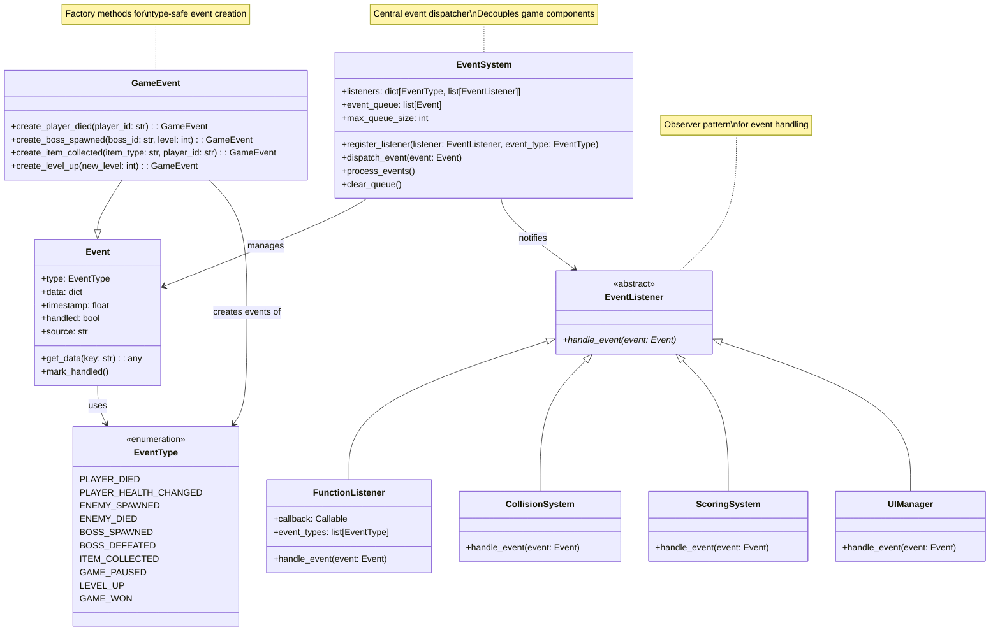
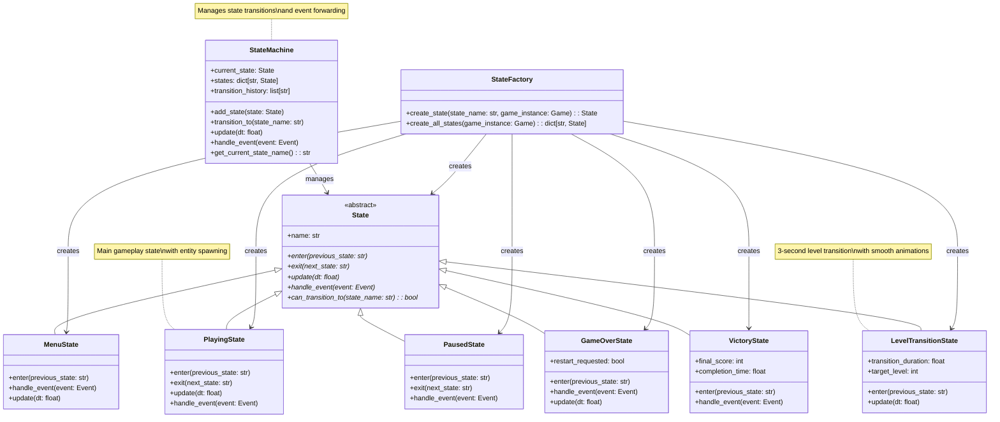
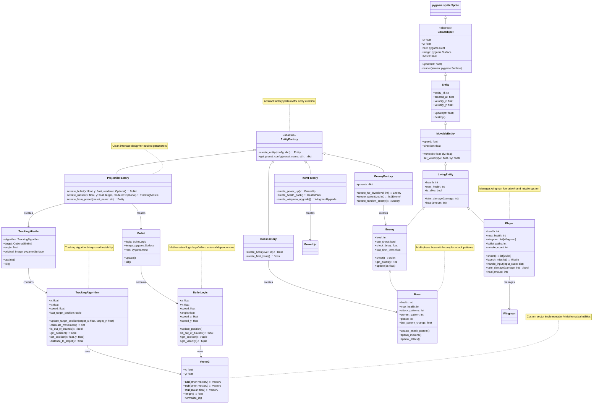
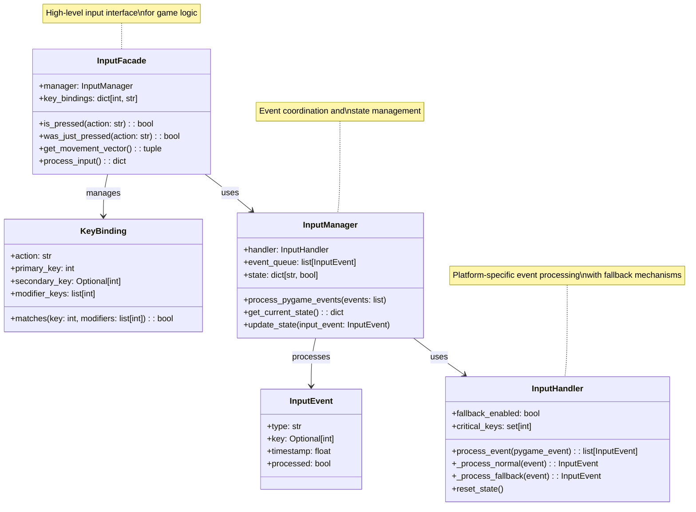
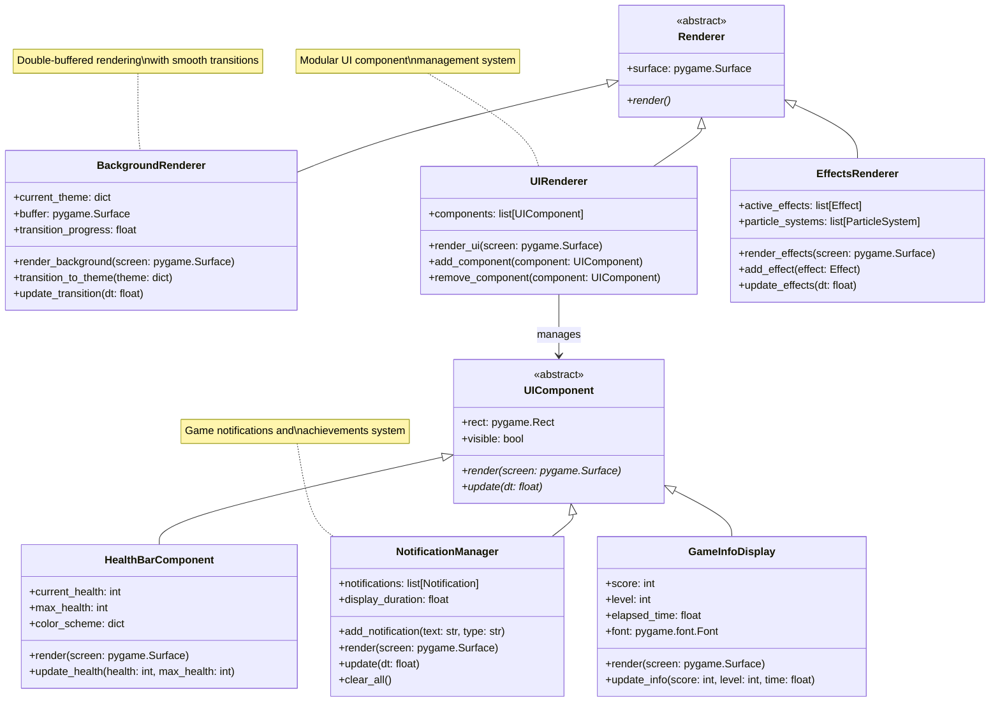

# Thunder Fighter UML Class Diagrams

## Overview

This document contains detailed UML class diagrams for Thunder Fighter's architecture. These diagrams provide comprehensive implementation details including method signatures, attributes, and relationships between classes.

## Table of Contents

1. [Event System Class Diagram](#event-system-class-diagram)
2. [State Management Class Diagram](#state-management-class-diagram)
3. [Entity System Class Diagram](#entity-system-class-diagram)
4. [Input System Class Diagram](#input-system-class-diagram)
5. [Graphics System Class Diagram](#graphics-system-class-diagram)

## Event System Class Diagram

## State Management Class Diagram

## Entity System Class Diagram

## Input System Class Diagram

## Graphics System Class Diagram

## Usage Guidelines

### For Architecture Documentation
- Reference these diagrams when discussing system relationships
- Focus on high-level component interactions in architecture docs
- Use simplified versions for architectural overviews

### For Technical Documentation
- Reference specific class details when documenting implementations
- Use method signatures for API documentation
- Include implementation file paths alongside diagram references

### For Development
- Use these diagrams as implementation reference
- Validate new features against existing class structures
- Ensure new components follow established patterns

---

*This document provides detailed UML class diagrams for Thunder Fighter's architecture. For high-level architectural concepts, see [Architecture Guide](ARCHITECTURE.md). For implementation details, see [Technical Details](TECHNICAL_DETAILS.md).*